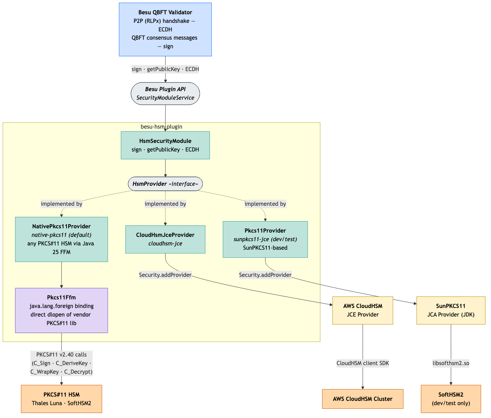

# Besu HSM Plugin
 [](https://github.com/besu-eth/besu-hsm-plugin/blob/main/LICENSE)
 [](https://github.com/besu-eth/besu/releases/tag/26.4.0)
 [](https://discord.com/invite/hyperledger)

A Hardware Security Module (HSM) plugin for [Besu](https://github.com/besu-eth/besu).
This plugin enables Besu validators to delegate cryptographic signing operations to an HSM, keeping
private keys secure in dedicated hardware rather than in software.

Three provider modes are supported. The default is `native-pkcs11`, which works with any
[PKCS#11](https://en.wikipedia.org/wiki/PKCS_11) HSM and is recommended for production.
`cloudhsm-jce` is the production path for AWS CloudHSM, and `generic-pkcs11` is a dev/test
option targeting SoftHSM2.

## Providers

Pick the provider that matches your HSM. The CLI flag values listed below are what you pass to
`--plugin-hsm-provider-type`.

- **`native-pkcs11`** *(default, recommended for production)* — Works with any PKCS#11 v2.40 HSM,
  including strict-spec HSMs such as **Thales Luna**. No certificate is required alongside the
  private key on the token.
- **`cloudhsm-jce`** *(production)* — Uses the [AWS CloudHSM JCE provider](https://docs.aws.amazon.com/cloudhsm/latest/userguide/java-library-install.html)
  directly, with no PKCS#11 configuration file. Authenticates via the `HSM_USER` and `HSM_PASSWORD`
  environment variables.
- **`generic-pkcs11`** *(dev/test only)* — Targets **SoftHSM2** for local development and
  integration tests. ECDH compatibility with production HSMs is **not** guaranteed; most strict
  v2.40 HSMs reject the required peer-point format. Requires `CKA_SENSITIVE=false` on derived
  secrets and a self-signed certificate associated with the private key on the token.
  **Production users should choose `native-pkcs11` or `cloudhsm-jce`.**

## Architecture



The plugin sits between Besu's validator process and the HSM, registering with Besu's
`SecurityModuleService`. Provider selection, key aliases, and authentication are configured via
plugin CLI options.

## Deployment Guides

Full walkthroughs for setting up a QBFT validator network on each supported HSM, including key
generation steps, are in:

- **Thales Luna** (PCIe / network HSM, `native-pkcs11`) — [`docs/thales-luna/README.md`](docs/thales-luna/README.md)
- **AWS CloudHSM** (`cloudhsm-jce`) — [`docs/aws-CloudHSM/`](docs/aws-CloudHSM/)
- **SoftHSM2** (local dev/test, `generic-pkcs11`) — [`docker/softhsm2/`](docker/softhsm2/)

## Plugin CLI Options

The plugin registers the following CLI options with Besu:

| Option | Description | Required |
|--------|-------------|----------|
| `--plugin-hsm-provider-type` | Provider type: `native-pkcs11` (default), `cloudhsm-jce`, or `generic-pkcs11` | No |
| `--plugin-hsm-config-path` | Path to the PKCS#11 configuration file | `native-pkcs11` and `generic-pkcs11` |
| `--plugin-hsm-password-path` | Path to the file containing the token PIN/password | `native-pkcs11` and `generic-pkcs11` |
| `--plugin-hsm-key-alias` | Alias/label of the private key on the HSM | Yes |
| `--plugin-hsm-public-key-alias` | Alias/label of the public key on the HSM | `cloudhsm-jce` only |
| `--plugin-hsm-cloudhsm-jar-path` | Path to CloudHSM JCE jar file or directory (default: `/opt/cloudhsm/java`) | No |
| `--plugin-hsm-ec-curve` | EC curve: `secp256k1` (default) or `secp256r1` | No |

### `native-pkcs11` example

```shell
besu --security-module=hsm \
  --plugin-hsm-config-path=/etc/besu/pkcs11.cfg \
  --plugin-hsm-password-path=/etc/besu/hsm-pin.txt \
  --plugin-hsm-key-alias=mykey
```

The PKCS#11 config file points the plugin at the vendor library and slot, e.g.:

```
library = /usr/safenet/lunaclient/lib/libCryptoki2_64.so
slot = 0
```

See the [Thales Luna deployment guide](docs/thales-luna/README.md) for the full config-file format
and a complete validator-setup walkthrough.

### `cloudhsm-jce` example

The CloudHSM JCE jar is auto-discovered from `/opt/cloudhsm/java/` by default; override with
`--plugin-hsm-cloudhsm-jar-path` if needed.

```shell
export HSM_USER=besu_crypto_user
export HSM_PASSWORD=<password>

besu --security-module=hsm \
  --plugin-hsm-provider-type=cloudhsm-jce \
  --plugin-hsm-key-alias=my-private-key \
  --plugin-hsm-public-key-alias=my-public-key
```

> **Note:** The CloudHSM JCE provider requires separate aliases for the private and public keys
> because CloudHSM does not associate certificates with key entries the way Java's SunPKCS11
> `KeyStore` does.

See the [AWS CloudHSM guides](docs/aws-CloudHSM/) for cluster setup and a full QBFT walkthrough.

### `generic-pkcs11` example *(dev/test)*

```shell
besu --security-module=hsm \
  --plugin-hsm-provider-type=generic-pkcs11 \
  --plugin-hsm-config-path=/etc/besu/pkcs11.cfg \
  --plugin-hsm-password-path=/etc/besu/hsm-pin.txt \
  --plugin-hsm-key-alias=mykey
```

> **Certificate requirement:** Java's SunPKCS11 `KeyStore` retrieves the public key via the
> certificate associated with the key alias (`KeyStore.getCertificate()`). The HSM must have a
> certificate stored alongside the private key — a self-signed certificate is sufficient.

> **ECDH key agreement:** Besu uses ECDH for devp2p handshakes. For this to work through
> SunPKCS11, the PKCS#11 configuration file must allow Java to extract the derived shared secret.
> Add the following to your configuration file:
>
> ```
> attributes(generate,CKO_SECRET_KEY,CKK_GENERIC_SECRET) = {
>   CKA_SENSITIVE = false
>   CKA_EXTRACTABLE = true
> }
> ```
>
> See [`docker/softhsm2/config/pkcs11-softhsm.cfg`](docker/softhsm2/config/pkcs11-softhsm.cfg)
> for a complete example. Most production HSMs reject these attributes — use `native-pkcs11` or
> `cloudhsm-jce` instead.

## Experimental: secp256r1 Curve Support

The plugin supports the secp256r1 (NIST P-256) elliptic curve as an alternative to the default
secp256k1, controlled by the `--plugin-hsm-ec-curve` CLI option:

```shell
--plugin-hsm-ec-curve=secp256r1
```

Besu itself must also be configured to use secp256r1 via the `ecCurve` field in the genesis file.
See the [Besu documentation on alternative elliptic curves](https://besu.hyperledger.org/private-networks/how-to/configure/curves)
for details.

> **Note:** Alternative elliptic curve support in Besu is experimental. The secp256r1 curve has
> been tested with SoftHSM2 in a 4-node QBFT network.

## Known Limitations

### DiscV5 (Discovery v5) requires secp256k1

DiscV5 is supported with HSM-backed keys, but only on the **secp256k1** curve. Besu's DiscV5
implementation (and the underlying ENR v4 identity scheme) is fixed to secp256k1, so HSM keys on
the **secp256r1** curve cannot participate in DiscV5 peer discovery. Use DiscV4 (`--bootnodes`)
or static peering (`--static-nodes-file`) for secp256r1 deployments.

PKCS#11's `CKM_ECDH1_DERIVE` returns only the x-coordinate of the ECDH shared point, so the
plugin recovers the y-parity needed for SEC1-compressed encoding via a second ECDH against a
probe point (`Q + G`). This costs one extra HSM round-trip per DiscV5 handshake.

## Useful Links

* [Besu User Documentation](https://besu.hyperledger.org)
* [Besu HSM Plugin Issues]
* [Besu Wiki](https://lf-hyperledger.atlassian.net/wiki/spaces/BESU/)
* [How to Contribute to Besu](https://lf-hyperledger.atlassian.net/wiki/spaces/BESU/pages/22156850/How+to+Contribute)
* [Besu Maintainers](https://github.com/besu-eth/besu/blob/main/MAINTAINERS.md)

If you have any questions, queries or comments, [Besu channel on Discord] is the place to find us.

## Development

* [Contributing Guidelines]
* [Coding Conventions](https://lf-hyperledger.atlassian.net/wiki/spaces/BESU/pages/22154259/Coding+Conventions)
* [Pull Requests](https://lf-hyperledger.atlassian.net/wiki/spaces/BESU/pages/22154251/Pull+Requests)

### Prerequisites

* [Java 25+](https://adoptium.net/) — the plugin uses the Java 25 Foreign Function & Memory API
  for the `native-pkcs11` provider.

### Building

```bash
./gradlew build
```

### Running Tests

```bash
# Unit tests
./gradlew test

# Integration tests (requires Docker)
./gradlew integrationTest
```

> **Container logs:** Integration tests are quiet by default. To dump full container
> logs to stderr — useful when an integration test fails locally, or when re-running
> a failed GitHub Actions job with [Enable debug logging] — set `RUNNER_DEBUG=1`:
>
> ```bash
> RUNNER_DEBUG=1 ./gradlew integrationTest
> ```

> **Note:** Integration tests build the SoftHSM2 image from `docker/softhsm2/Dockerfile`,
> pinning `hyperledger/besu` to the version declared in `gradle/libs.versions.toml`
> (`besu = "..."`). Bumping the catalog automatically updates the integration-test image.

[Enable debug logging]: https://docs.github.com/en/actions/how-tos/monitor-workflows/enable-debug-logging

[Besu HSM Plugin Issues]: https://github.com/besu-eth/besu-hsm-plugin/issues
[Besu channel on Discord]: https://discord.com/invite/hyperledger
[Contributing Guidelines]: CONTRIBUTING.md
